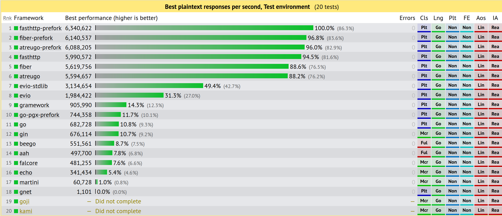
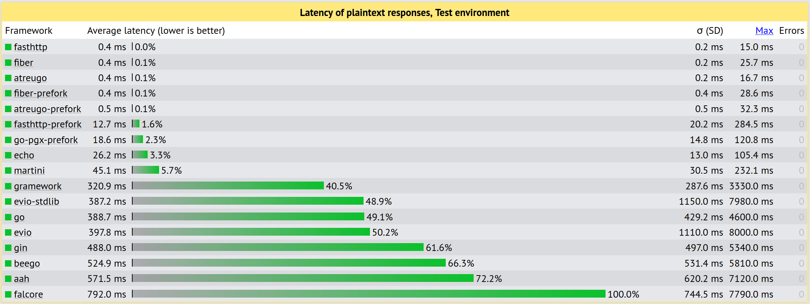
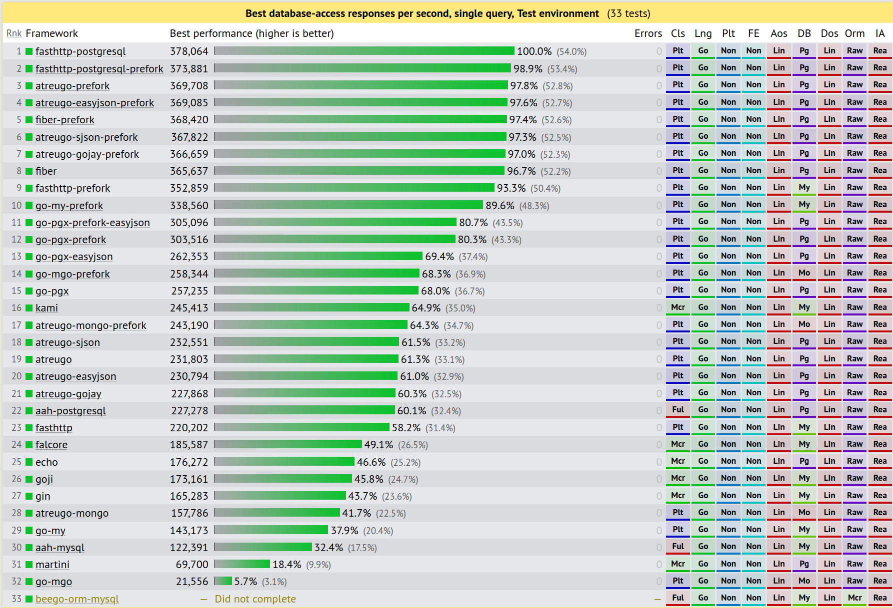
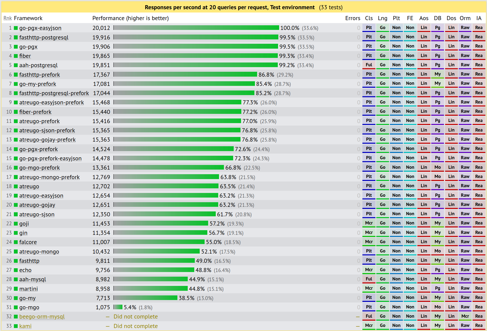
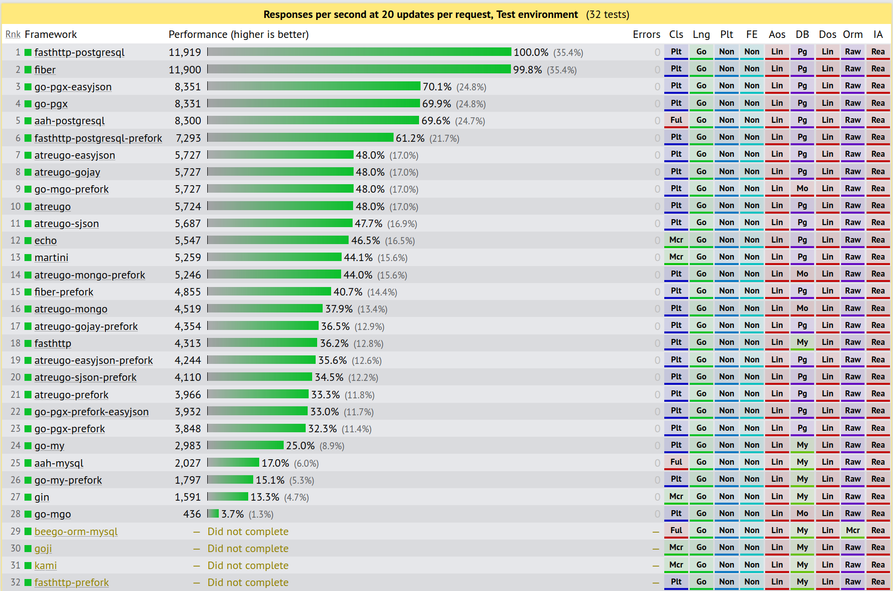
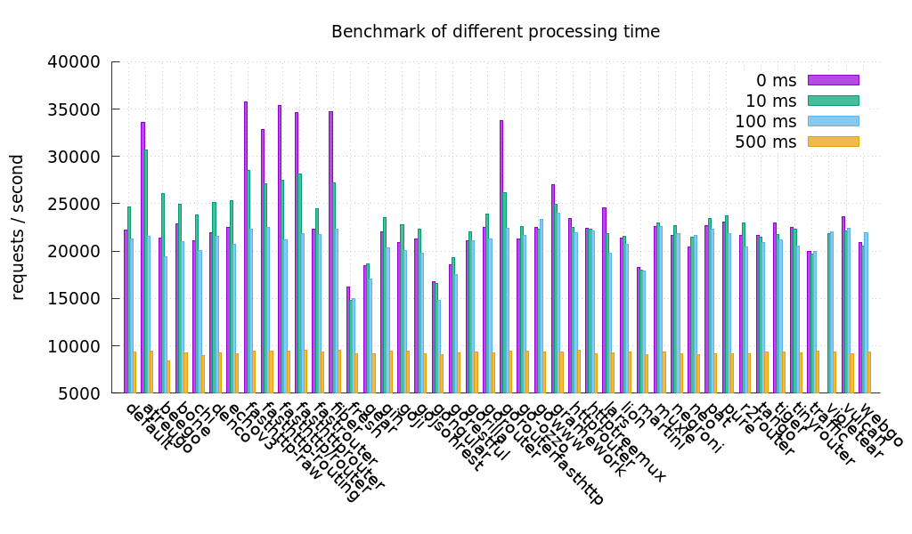
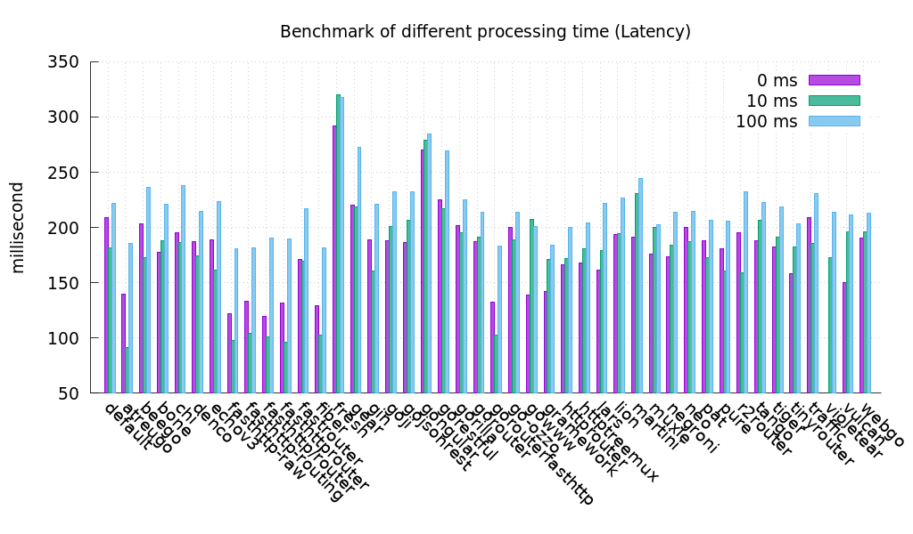
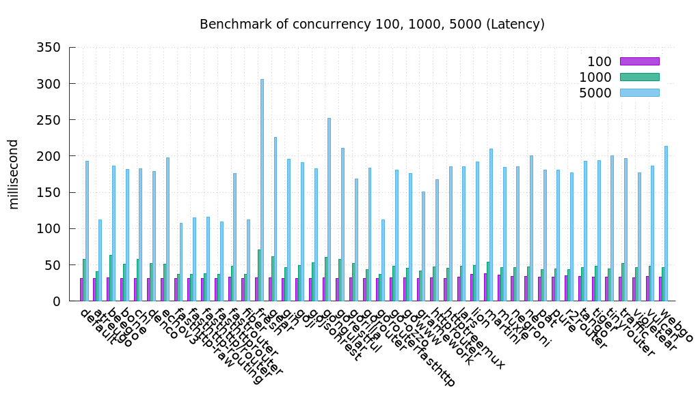

# 🤖  Benchmarks

## TechEmpower

🔗 [https://www.techempower.com/benchmarks/](https://www.techempower.com/benchmarks/)

* **CPU** Intel Xeon Gold 5120
* **MEM** 32GB
* **GO** go1.13.6 linux/amd64
* **OS** Linux
* **NET** Dedicated Cisco 10-gigabit Ethernet switch.

To see all language frameworks, visit [Plaintext All Results](https://www.techempower.com/benchmarks/#section=test&runid=350f0783-cc9b-4259-9831-28987799782a&hw=ph&test=plaintext).  
To view the list yourself, visit [Plaintext Go Results](https://www.techempower.com/benchmarks/#section=test&runid=350f0783-cc9b-4259-9831-28987799782a&hw=ph&test=plaintext&l=zijocf-1r).

#### Plaintext

#### Plaintext latency

#### JSON serialization

#### Single query

#### Multiple queries

#### Data updates

## Go web framework benchmark

🔗 [https://github.com/smallnest/go-web-framework-benchmark](https://github.com/smallnest/go-web-framework-benchmark)

* **CPU** Intel\(R\) Xeon\(R\) Gold 6140 CPU @ 2.30GHz
* **MEM** 4GB
* **GO** go1.13.6 linux/amd64
* **OS** Linux

The first test case is to mock **0 ms**, **10 ms**, **100 ms**, **500 ms** processing time in handlers.

The concurrency clients are **5000**.

Latency is the time of real processing time by web servers. _The smaller is the better._

Allocs is the heap allocations by web servers when test is running. The unit is MB. _The smaller is the better._

If we enable **http pipelining**, test result as below:

Concurrency test in **30 ms** processing time, the test result for **100**, **1000**, **5000** clients is:

If we enable **http pipelining**, test result as below:

