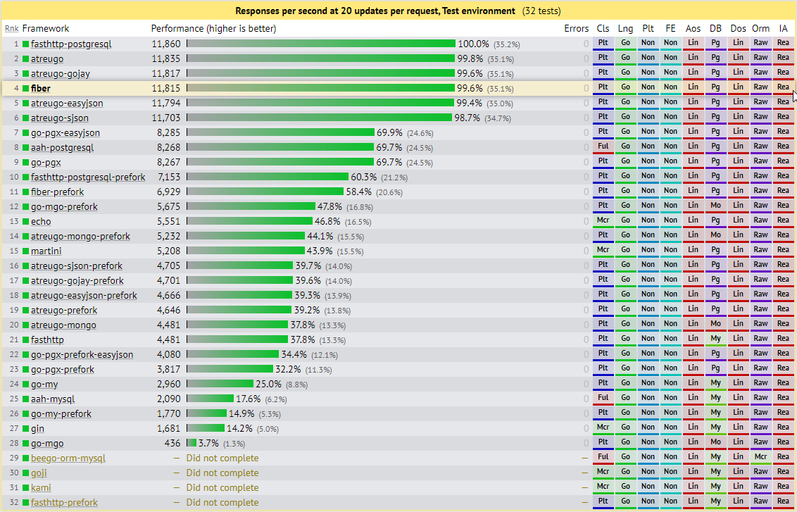
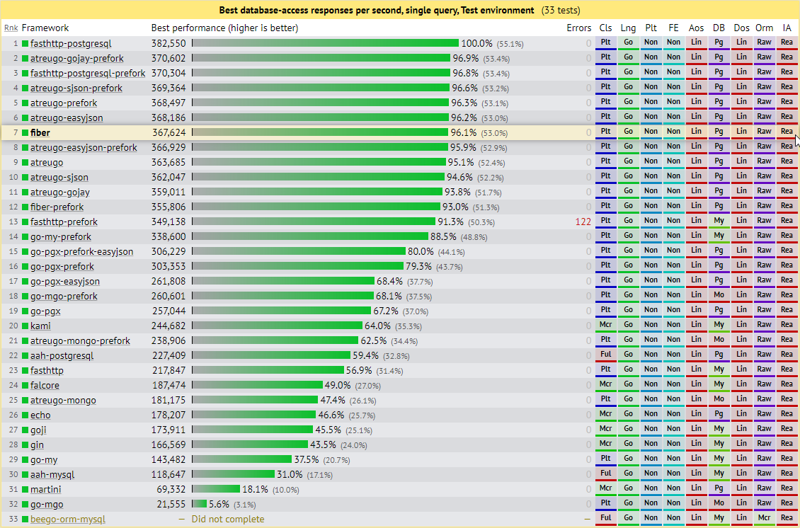

# 🤖 Benchmarks

## TechEmpower

🔗 [https://www.techempower.com/benchmarks/](https://www.techempower.com/benchmarks/#section=test&runid=02692910-4c3f-4c56-a9dc-f0167a4280a4)

Fiber v1.8.42

* **CPU** Intel Xeon Gold 5120
* **MEM** 32GB
* **GO** go1.13.6 linux/amd64
* **OS** Linux
* **NET** Dedicated Cisco 10-gigabit Ethernet switch.

### Plaintext

**Fiber** handled **6,091,966** responses per second with an average latency of **1.9** ms.  
**Express** handled **368,303** responses per second with an average latency of **346.2** ms.

### Data Updates

**Fiber** handled **11,815** responses  per second with an average latency of **42.9** ms.  
**Express** handled **1,221** responses  per second with an average latency of **412.6** ms.

### Multiple Queries

**Fiber** handled **19,895** responses per second with an average latency of **25.4** ms.  
**Express** handled **4,280** responses  per second with an average latency of **117.8** ms.

### Single Query

**Fiber** handled **367,624** responses per second with an average latency of **0.7** ms.  
**Express** handled **57,503** responses  per second with an average latency of **4.4** ms.

### JSON Serialization

**Fiber** handled **1,108,213** responses per second with an average latency of **0.5** ms.  
**Express** handled **245,211** responses  per second with an average latency of **1.1** ms.

## Go web framework benchmark

🔗 [https://github.com/smallnest/go-web-framework-benchmark](https://github.com/smallnest/go-web-framework-benchmark)

* **CPU** Intel\(R\) Xeon\(R\) Gold 6140 CPU @ 2.30GHz
* **MEM** 4GB
* **GO** go1.13.6 linux/amd64
* **OS** Linux

The first test case is to mock **0 ms**, **10 ms**, **100 ms**, **500 ms** processing time in handlers.

The concurrency clients are **5000**.

Latency is the time of real processing time by web servers. _The smaller is the better._

Allocs is the heap allocations by web servers when test is running. The unit is MB. _The smaller is the better._

If we enable **http pipelining**, test result as below:

Concurrency test in **30 ms** processing time, the test result for **100**, **1000**, **5000** clients is:

If we enable **http pipelining**, test result as below:

