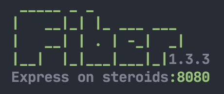

# 🚀 应用

## 实例

该方法创建一个新的**Fiber**实例。

```go
app := fiber.New()
```

## 静态文件

提供静态文件，例如**图像** ， **CSS**和**JavaScript**文件，可以使用**Static**方法。


默认情况下，此方法将发送`index.html`文件以响应对目录的请求。


#### 签名

```go
app.Static(root string)         // => without prefix
app.Static(prefix, root string) // => with prefix
```

#### 示例

使用以下代码将处理名为`./public`目录中的文件

```go
app.Static("./public")

// => http://localhost:3000/hello.html
// => http://localhost:3000/js/jquery.js
// => http://localhost:3000/css/style.css
```

要提供多个静态目录服务，可以多次使用**Staic** 。

```go
// Serve files from "./public" directory:
app.Static("./public")

// Serve files from "./files" directory:
app.Static("./files")
```


使用[NGINX](https://www.nginx.com/resources/wiki/start/topics/examples/reverseproxycachingexample/)之类的反向代理缓存来提高提供静态文件的性能。


要为**Static**方法提供服务的*文件*创建虚拟路径前缀（ *该路径在文件系统中实际上不存在* ），请为静态目录指定前缀路径，如下所示：

```go
app.Static("/static", "./public")

// => http://localhost:3000/static/hello.html
// => http://localhost:3000/static/js/jquery.js
// => http://localhost:3000/static/css/style.css
```

## 方法

路由HTTP请求，其中**METHOD**是请求的[HTTP方法](https://developer.mozilla.org/en-US/docs/Web/HTTP/Methods) 。

#### 签名

```go
app.METHOD(handler func(*Ctx))              // match any path
app.METHOD(path string, handler func(*Ctx)) // match specific path
```

#### 示例

```go
// Single method
app.Connect(...)
app.Delete(...)
app.Get(...)
app.Head(...)
app.Options(...)
app.Patch(...)
app.Post(...)
app.Put(...)
app.Trace(...)

// Matches all methods & complete path
app.All(...)

// Matches all methods & URLs starting with a specified path
app.Use(...)
```

## Recover

通过注册一个`Recover`方法，您可以从任何程序中的Panic的中恢复。你可以使用`.Error()`访问错误信息。


默认情况下，`Recover`是禁用的，除非您注册了一个处理程序。


### 签名

``` go
app.Recover(handler ...func(*Ctx))
```

#### 示例

```go
func main() {
  app := fiber.New()

  app.Get("/", func(c *fiber.Ctx) {
    panic("Something went wrong!")
  })

  app.Recover(func(c *fiber.Ctx) {
    c.Status(500).Send(c.Error())
    // => 500 "Something went wrong!"
  })

  app.Listen(3000)
}
```

## 监听

绑定并侦听指定地址上的连接。这可以是端口的`int`或地址的`string` 。

#### 签名

```go
app.Listen(address interface{}, tls ...string)
```

#### 示例

```go
app.Listen(8080)
app.Listen("8080")
app.Listen(":8080")
app.Listen("127.0.0.1:8080")
```

要启用**TLS/HTTPS，**您可以附加**证书**和**密钥**的路径。

```go
app.Listen(443, "server.crt", "server.key")
```

## 设定值

### 引擎

您可以通过**Fiber**实例更改默认的**Fasthttp**[服务器设置](https://github.com/valyala/fasthttp/blob/master/server.go#L150)。这些设置需要**在[Listen](application.md#listen)**方法**之前**进行设置。


如果您知道自己在**做什么**,请仅更改这些设置。


```go
app.Engine.Concurrency = 256 * 1024
app.Engine.DisableKeepAlive = false
app.Engine.ReadBufferSize = 4096
app.Engine.WriteBufferSize = 4096
app.Engine.ReadTimeout = 0
app.Engine.WriteTimeout = 0
app.Engine.IdleTimeout = 0
app.Engine.MaxConnsPerIP = 0
app.Engine.MaxRequestsPerConn = 0
app.Engine.TCPKeepalive = false
app.Engine.TCPKeepalivePeriod = 0
app.Engine.MaxRequestBodySize = 4 * 1024 * 1024
app.Engine.ReduceMemoryUsage = false
app.Engine.GetOnly = false
app.Engine.DisableHeaderNamesNormalizing = false
app.Engine.SleepWhenConcurrencyLimitsExceeded = 0
app.Engine.NoDefaultContentType = false
app.Engine.KeepHijackedConns = false
```

### Prefork

Prefork允许使用[**SO_REUSEPORT**](https://lwn.net/Articles/542629/)套接字选项，该选项在许多操作系统的较新版本中可用，包括**DragonFly BSD**和**Linux**(内核版本**3.9**及更高版本)。这将在同一端口上侦听多个Go进程。

**NGINX**撰写了一篇有关[Socket Sharding](https://www.nginx.com/blog/socket-sharding-nginx-release-1-9-1/)的精彩文章，这些图片摘自这一篇文章。


您可以通过添加`-prefork`标志来启用Prefork功能：

```bash
./server -prefork
```

或将`Prefork`选项设置为`true` ：

```go
app.Prefork = true // Prefork enabled

app.Get("/", func(c *fiber.Ctx) {
  msg := fmt.Sprintf("Worker #%v", os.Getpid())
  c.Send(msg)
  // => Worker #16858
  // => Worker #16877
  // => Worker #16895
})
```

### 服务器

Fiber默认情况下不发送[服务器头](https://developer.mozilla.org/en-US/docs/Web/HTTP/Headers/Server) ，但是您可以通过更改服务器的值来启用它。

```go
app.Server = "Windows 95" // => Server: Windows 95
```

### 标志

启动Fiber应用程序时，控制台将显示包含程序包版本和监听端口的提示。 *默认情况下启用*。



要禁用它，请将`Banner`设置为`false` ：

```go
app.Banner = false // Hide banner
```

## 测试

使用**Test**方法完成对应用程序的**测试** 。


方法主要用于`_test.go`文件和应用程序调试。


#### 签名

```go
app.Test(req *http.Request) (*http.Response, error)
```

#### 示例

```go
// Create route with GET method for test:
app.Get("/", func(c *Ctx) {
  fmt.Println(c.BaseURL())              // => http://google.com
  fmt.Println(c.Get("X-Custom-Header")) // => hi

  c.Send("hello, World!")
})

// http.Request
req, _ := http.NewRequest("GET", "http://google.com", nil)
req.Header.Set("X-Custom-Header", "hi")

// http.Response
resp, _ := app.Test(req)

// Do something with results:
if resp.StatusCode == 200 {
  body, _ := ioutil.ReadAll(resp.Body)
  fmt.Println(string(body)) // => Hello, World!
}
```
